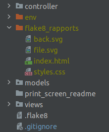
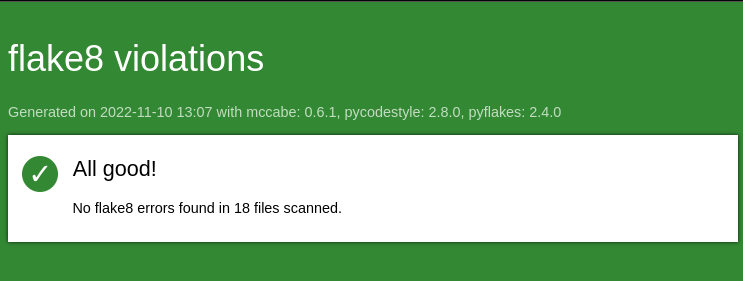

# Logiciel de gestion de tournoi d'échecs

## Description
Ce logiciel permet de gérer un tournoi d'échecs et a été créé dans le cadre du projet *Développez un programme logiciel 
en Python* de la formation OpenClassrooms *Développeur d'application Python*.

Le programme permet de créer des profils de joueurs, et de créer un tournoi. L'appariement des joueurs pour chaque match 
de chaque tournée est basé sur un système de tournoi suisse. Il est possible à tout moment de quitter le programme, ce 
qui aura pour effet de sauvegarder les joueurs qui ont été créés ainsi que le tournoi en l'état. Le détail du tournoi 
peut être consulté à tout moment. Enfin, l'utilisateur peut rentrer les résultats de chaque match joué.

## Procédure d'installation

### Création d'un environnement virtuel

Il est recommandé d'installer un environnement virtuel. Pour ce faire, suivez les instructions 
ci-dessous :

- S'il ne l'est pas déjà, installez le package *virtualenv* :
```sh
pip install virtualenv
```

- Créez un environnement de travail dans votre répertoire courant et activez-le :
```sh
virtualenv env
source env/bin/activate
```

### Installation des librairies

- Installez les librairies nécessaires au bon fonctionnement du programme à l'aide du fichier requirements.txt :
```sh
git clone https://github.com/lcourdes/Programme_logiciel_chess_tournament.git
cd Programme_logiciel_chess_tournament
pip install -r requirements.txt
```

## Utilisation du programme

### Lancement du programme

Pour démarrer le programme, utilisez la commande suivante :
```sh
python3 main.py
```

### En cours d'utilisation

#### Démarrage du programme
Au démarrage, le menu principal propose à l'utilisateur d'accéder au Menu Acteurs ou de créer/charger un tournoi.
- Le Menu acteur consiste en la gestion de tous les joueurs, qu'ils soient actuellement inscrits à un tournoi ou non.
- La deuxième possibilité consiste à accéder au menu de gestion d'un tournoi.

```sh
Bienvenue sur le logiciel de gestion de tournoi d'échecs.

Veuillez sélectionner une option ci-dessous en spécifiant le chiffre correspondant.

0 - Quitter le programme.
1 - Accéder au Menu Acteurs.
2 - Créer/charger un tournoi
```

Le programme attend alors un input utilisateur. Il est nécessaire de renseigner le numéro correspondant au sous-menu 
choisi (en l'occurrence ici 0, 1 ou 2)

#### Gestion des acteurs

Après avoir entré 1 dans le menu principal, l'utilisateur accède au Menu des acteurs.
```sh
Bienvenue sur le logiciel de gestion de tournoi d'échecs.

Veuillez sélectionner une option ci-dessous en spécifiant le chiffre correspondant.

0 - Quitter le programme.
1 - Accéder au Menu Acteurs.
2 - Créer/charger un tournoi
1
```

```shell
Menu de gestion des joueurs de la base de données.

Veuillez sélectionner une option ci-dessous en spécifiant le chiffre correspondant.

0 - Quitter le programme.
1 - Retourner au menu principal.
2 - Créer un profil Joueur.
3 - Trier les joueurs par nom.
4 - Trier les joueurs par classement.
5 - Modifier le classement d'un joueur.
```
 
L'utilisateur a dès lors la possibilité :
  - de créer un nouveau joueur. Il sera alors demandé à l'utilisateur de renseigner 
    - le nom de famille, 
    - le prénom, 
    - la date de naissance, 
    - le genre,
    - le classement du joueur. 

Ce joueur sera désormais toujours présent dans la base de données des joueurs et pourra être inscrits dans un tournoi.
  - de trier les joueurs par nom. L'utilisateur verra s'afficher dans la console tous les joueurs de la base de données
triés par ordre alphabétique en fonction de leur nom de famille.
  - de trier les joueurs par classement. L'utilisateur verra s'afficher dans la console tous les joueurs de la base de 
données triés par classement (du meilleur au moins bon classement). Attention, aux échecs un joueur ayant un classement
20 et mieux classé qu'un joueur classé 10.
  - de modifier le classement d'un joueur. L'utilisateur verra s'afficher dans la console tous les joueurs de la base de 
données. Il pourra sélectionner un joueur par son identifiant, et rentrer le nouveau classement du joueur.

#### Menu de création/chargement d'un tournoi

Après avoir entré 2 dans le menu principal, l'utilisateur accède au Menu de création/chargement d'un tournoi.
```sh
Bienvenue sur le logiciel de gestion de tournoi d'échecs.

Veuillez sélectionner une option ci-dessous en spécifiant le chiffre correspondant.

0 - Quitter le programme.
1 - Accéder au Menu Acteurs.
2 - Créer/charger un tournoi
2
```

```sh
Menu de création/chargement d'un tournoi.

Veuillez sélectionner une option ci-dessous en spécifiant le chiffre correspondant.

1 - Créer un nouveau tournoi.
2 - Charger un tournoi en cours.
```

L'utilisateur a dès lors la possibilité :
- de créer un nouveau tournoi. Attention, ceci aura pour effet de supprimer un éventuel tournoi déjà créé. 
Il sera alors demandé à l'utilisateur de renseigner :
  - le nom, 
  - le lieu,
  - la date de début,
  - la date de fin,
  - une description,
  - le type de parties (Blitz, Bullet, Coup rapide)
  - le nombre de tournées du tournoi.
- de charger un tournoi qui a déjà été créé. Si un tournoi a déjà été créé, celui-ci peut donc être chargé. Dans le cas 
inverse, l'utilisateur est informé qu'aucun tournoi n'est en cours et qu'il doit en créé un.

A l'issue, de ce processus l'utilisateur accède automatiquement au menu de gestion principal d'un tournoi.

#### Gestion d'un tournoi

```sh
Bienvenue dans le menu de gestion du tournoi en cours.

Veuillez sélectionner une option ci-dessous en spécifiant le chiffre correspondant.

0 - Quitter le programme.
1 - Revenir au menu principal.
2 - Voir/gérer les joueurs du tournoi en cours.
3 - Voir/gérer le tournoi en cours.
```

L'utilisateur a dès lors la possibilité de voir/gérer les joueurs du tournoi en cours ou alors, de voir/gérer le tournoi 
en lui-même.

#### Gestion d'un tournoi -- Gérer les joueurs du tournoi

Après avoir entré 2 dans le menu de gestion d'un tournoi en cours, l'utilisateur accède à la gestion des joueurs.

```sh
Bienvenue dans le menu de gestion du tournoi en cours.

Veuillez sélectionner une option ci-dessous en spécifiant le chiffre correspondant.

0 - Quitter le programme.
1 - Revenir au menu principal.
2 - Voir/gérer les joueurs du tournoi en cours.
3 - Voir/gérer le tournoi en cours.
2
```

```sh
Menu de gestion des joueurs du tournoi en cours.

Veuillez sélectionner une option ci-dessous en spécifiant le chiffre correspondant.

0 - Quitter le programme.
1 - Retourner au menu de gestion du tournoi.
2 - Ajouter un joueur au tournoi en cours.
3 - Trier les joueurs du tournoi par nom.
4 - Trier les joueurs du tournoi par classement.
5 - Modifier le classement d'un joueur du tournoi.
```

En entrant 2, l'utilisateur peut ajouter un joueur au tournoi. Soit en créant un nouveau joueur, soit en ajoutant un 
joueur déjà présent dans la base.

* En entrant 1, l'utilisateur choisit de créer un nouveau joueur.
    ```sh
    Veuillez sélectionner une option ci-dessous en spécifiant le chiffre correspondant.
    
    1 - Créer un nouveau joueur et l'ajouter au tournoi.
    2 - Sélectionner un joueur de la base et l'ajouter au tournoi.
    1
    ```

    L'option permettant de créer un nouveau joueur est strictement identique pour l'utilisateur à celle de créer un nouveau 
joueur depuis le Menu Acteur, à savoir, l'utilisateur doit renseigner :
  - le nom de famille, 
  - le prénom, 
  - la date de naissance, 
  - le genre,
  - le classement du joueur. 

    Le joueur ainsi créé est inscrit au tournoi en cours et figurera désormais dans les joueurs de la base de données.


* En entrant 2, l'utilisateur choisit de sélectionner un joueur dont le profil existe déjà pour l'inscrire au tournoi.
    ```sh
    Veuillez sélectionner une option ci-dessous en spécifiant le chiffre correspondant.
    
    1 - Créer un nouveau joueur et l'ajouter au tournoi.
    2 - Sélectionner un joueur de la base et l'ajouter au tournoi.
    2
    ```
  S'affiche alors, sur la console, l'ensemble des joueurs présents dans la base de données ainsi que leur identifiant. 
L'utilisateur saisi l'identifiant d'un joueur pour que celui-ci soit inscrit au tournoi.

Depuis le menu de gestion des joueurs du tournoi en cours, l'utilisateur peut également : 
- trier les joueurs par nom (en tapant 3)
- trier les joueurs par classement (en tapant 4)
- modifier le classement d'un joueur (en tapant 5).
```sh
Menu de gestion des joueurs du tournoi en cours.

Veuillez sélectionner une option ci-dessous en spécifiant le chiffre correspondant.

0 - Quitter le programme.
1 - Retourner au menu de gestion du tournoi.
2 - Ajouter un joueur au tournoi en cours.
3 - Trier les joueurs du tournoi par nom.
4 - Trier les joueurs du tournoi par classement.
5 - Modifier le classement d'un joueur du tournoi.
```

Ces options sont strictement identiques à celles du Menu Acteurs, à ceci près que seuls les joueurs inscrits au tournoi 
sont affichés.

#### Gestion d'un tournoi -- Gérer le tournoi en lui-même

Il est possible à l'utilisateur de gérer le tournoi en lui-même en tapant 3 dans le menu de gestion du tournoi en cours.
Pour avoir la possibilité d'accéder à la suite du programme, huit joueurs doivent d'ores et déjà être inscrits au 
tournoi en cours.
```sh
Bienvenue dans le menu de gestion du tournoi en cours.

Veuillez sélectionner une option ci-dessous en spécifiant le chiffre correspondant.

0 - Quitter le programme.
1 - Revenir au menu principal.
2 - Voir/gérer les joueurs du tournoi en cours.
3 - Voir/gérer le tournoi en cours.
3
```
```sh
Menu Tournoi.

Veuillez sélectionner une option ci-dessous en spécifiant le chiffre correspondant.

0 - Quitter le programme.
1 - Retourner au menu de gestion du tournoi.
2 - Afficher les détails du tournoi.
3 - Lancer une tournée.
```

L'utilisateur a dès lors deux possibilités : 
- afficher les détails du tournoi (en tapant 2). Ceci aura pour effet d'afficher les informations principales du tournoi
(nom, lieu, date, etc.). Seront également affichés les scores actualisés du tournoi en cours ainsi qu'un récapitulatif 
de chacune des tournées.
- lancer une nouvelle (en tapant 3). Ceci aura pour effet de créer ou de charger une tournée encore en cours en fonction de l'état 
d'avancement du tournoi. L'utilisateur accède alors à la tournée en cours, où s'affiche : 
  - le nom de la tournée en cours,
  - la liste des matchs de la tournée. Les matchs sont numérotés et affichés sous forme de liste.
    - Pour chaque match est expliqué quels sont les deux joueurs désignés ainsi que la distribution des couleurs.
  
  L'utilisateur a la possibilité d'entrer le résultat d'un match en tapant 2 dans le menu qui est affiché :
  ```shell
  Veuillez sélectionner une option ci-dessous en spécifiant le chiffre correspondant.
  
  0 - Quitter le programme.
  1 - Retourner au menu Tournoi.
  2 - Entrer le résultat d'un match.
  2
  ```
  Il est alors demandé à l'utilisateur pour quel match, il souhaite rentrer un résultat. Il suffit de rentrer le numéro 
de match. L'utilisateur a alors le choix entre trois possibilités : choisir lequel des deux joueurs a gagné, ou marquer 
un match Pat.
    
  Lorsqu'un résultat de match est entré, celui-ci s'affiche automatiquement dans la liste des matchs de la tournée en 
cours.

## Archivage des données

Lorsque l'utilisateur décide de quitter le programme, un fichier intitulé *db.json* est créé dans le répertoire courant.
Celui-ci est généré à l'aide de la librairie TinyDB.
Ce fichier contient deux tables :
- une table 'players' qui regroupe sous forme de dictionnaire les informations de chacun des joueurs ayant été créé à 
l'aide du logiciel. Ce dictionnaire contient pour chaque joueur : 
  - Nom de famille
  - Prénom
  - Date de naissance
  - Genre
  - Classement
- une table 'tournament' qui regroupe sous forme de dictionnaire les informations du tournoi en cours c'est-à-dire : 
    - Nom
    - Lieu
    - Date du tournoi
    - Date de création
    - Description
    - Type de jeu
    - Nombre de tournées
    - Liste des identifiants des joueurs inscrits
    - Liste des tournées
      - Nom du round
      - Appariement des joueurs
      - Liste des matchs
        - Identifiant des deux joueurs du match
        - Distribution des couleurs
        - Résultat

## Génération de rapports flake8 au format html

Afin de s'assurer que le programme est conforme aux conventions définies par la PEP8, il peut être intéressant de 
générer des rapports flake8. De plus, afin que ceux-ci soient plus lisibles, le plugin flake8 html est présent dans le 
requirements.txt.

### Génération des rapports

Assurez-vous de bien avoir le fichier *.flake8* qui permettra, d'une part, ne pas prendre en compte l'environnement 
virtuel lors de la génération des rapports et, d'autre part, s'assurer qu'une ligne doit avoir pour longueur maximale 
120 caractères.

Dans le terminal, situé à la racine du projet :
```sh
flake8 --format=html --htmldir=flake8_rapports
```

### Visualisation des rapports

Est créé, à la racine du projet, un dossier *flake8_rapports* qui contient les rapports ainsi créés. 



Ouvrez le fichier *index.html* qui permet une navigation facilitée.



## Lien Github

[](https://github.com/lcourdes/Programme_logiciel_chess_tournament)